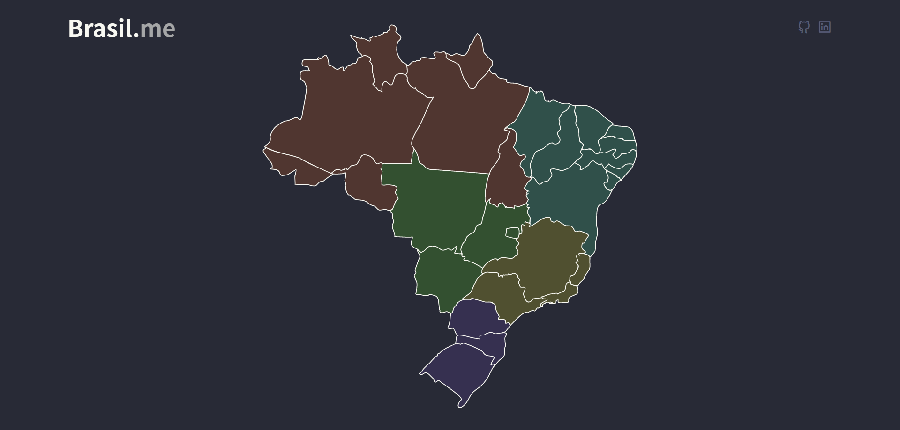

<h1>Brasil.me</h1>

 &nbsp;
 

>Interação com o mapa do Brasil, dividido em estados, baseado no projeto de [Lucas Souza](https://github.com/lluukinha/manipulateSvg) 🗺️

## 💻 Sobre o Projeto

O Brasil.me foi desenvolvido pensando nas crianças e adolescentes que se encontram no ensino fundamental e médio, a fim de entenderem como funciona as divisões regionais de nosso país. Com essa aplicação, o usuário pode interagir com os estados, selecionando o estado desejado, que irá conter algumas informações tais como capital, área, população e uma breve descrição.

Acredito que desta forma, traga mais interesse por parte dos alunos à se dedicarem aos estudos, os envolvendo de uma forma contagiante e divertida!

## 🚀 Tecnologias

Esse projeto foi desenvolvido com as seguintes tecnologias:

- HTML5
- CSS3
- JavaScript
- JSON

## 📚 Aprendizado

Alguns aprendizados que pratiquei realizando o projeto:

- Link target _blank: abre link em outra guia
- CSS Flexbox
- Modal com JavaScript
- Manipulação de vetores (.svg)
- Leitura de arquivo externo (.json)

## 💻 Telas

## ⚙️ Materiais Utilizados

- Google Fonts: [Noto Sans JP](https://fonts.google.com/specimen/Noto+Sans+JP) e [IBM Plex Mono](https://fonts.google.com/specimen/IBM+Plex+Mono)

## 🤖 Créditos & Agradecimentos

Sem eles, este projeto não seria possível!

- [Lucas Souza](https://github.com/lluukinha/manipulateSvg)
- [IBGE](https://www.ibge.gov.br/)

## 📋 Licença

Este projeto está sob a licença [MIT](LICENSE). Projeto realizado apenas para fins didáticos. Fique à vontade para utilizar todo o conteúdo deste repositório!

---

Obrigado pela atenção! 😃